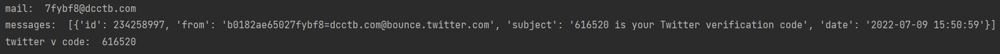

# FakeMail

✅ Fake mail using python 🐍

## How to use

1. Clone the code : `git clone https://github.com/MatinGhanbari/FakeMail.git`
2. Open code and run it to get a mail
3. Set your mail in code
4. run it again to get messages

### **You can copy and pase functions to your code.**

## Run

